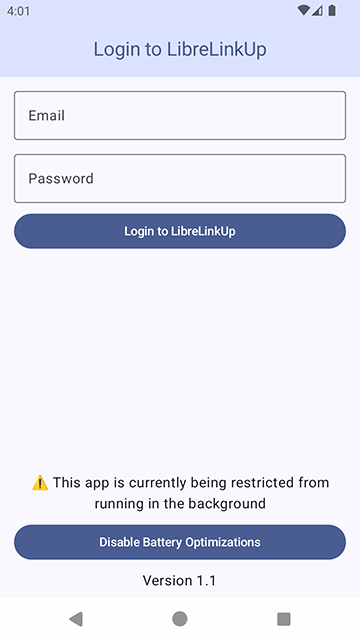

<!--
 Copyright 2024 Sam Steele
 
 Licensed under the Apache License, Version 2.0 (the "License");
 you may not use this file except in compliance with the License.
 You may obtain a copy of the License at
 
     http://www.apache.org/licenses/LICENSE-2.0
 
 Unless required by applicable law or agreed to in writing, software
 distributed under the License is distributed on an "AS IS" BASIS,
 WITHOUT WARRANTIES OR CONDITIONS OF ANY KIND, either express or implied.
 See the License for the specific language governing permissions and
 limitations under the License.
-->

# HealthConnect-LibreLinkUp

Syncs the latest glucose reading from Freestyle Libre sensors via LibreLinkUp to HealthConnect and WearOS

## Install

Install `app-release.apk` on your phone and the optional `wearable-release.apk` on your WearOS watch

## Usage

Open the Freestyle Libre app and tap "Connected Apps" from the menu, then send yourself an invitation to view your data via LibreLinkUp.  Install the LibreLinkUp app on your phone, login, and accept the invitation.

Launch the `LibreLinkUp for HealthConnect` app on your phone, enter your Freestyle LibreLinkUp email address and password, then tap the login button.

You may need to modify the `LIBRELINKUP_URL` variable in `app/src/main/java/org/c99/healthconnect_librelinkup/LibreLinkUp.java` if you're using the servers in a different region.  A future release will include a setting to change regions without recompiling the app.

The app will fetch your latest glucose setting every 15 minutes and write the new value into HealthConnect.
The wearable apk also provides a complication and tile to view the latest reading on your WearOS device.

## License

Copyright (C) 2024 Sam Steele. Licensed under the Apache License, Version 2.0 (the "License"); you may not use this file except in compliance with the License. You may obtain a copy of the License at

http://www.apache.org/licenses/LICENSE-2.0

Unless required by applicable law or agreed to in writing, software distributed under the License is distributed on an "AS IS" BASIS, WITHOUT WARRANTIES OR CONDITIONS OF ANY KIND, either express or implied. See the License for the specific language governing permissions and limitations under the License.